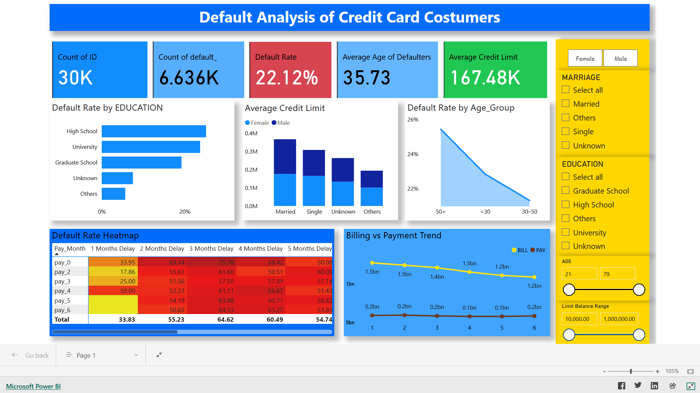

# 🧠 Credit Card Default Prediction Dashboard

## 📌 Overview
This Power BI project analyzes card payment default behavior using real-world financial data.  
It highlights customer spending, billing trends, repayment patterns, and provides predictive insights for financial risk assessment.

---

## 🔗 Project Links

- **🔹 Power BI Dashboard :** [View Dashboard](https://app.powerbi.com/view?r=eyJrIjoiZDFhYjI2ZDEtNjcyNy00MmUwLWFhMGYtZjk0YmMyNzNlNjZkIiwidCI6IjM4ZjYyOTI2LTc1NTktNGFlZi04NGFlLWNiNWUxNzI0MDZmYiJ9)  
- **🔹 Dataset Used:** [UCI Credit Card Default Dataset](https://www.kaggle.com/datasets/uciml/default-of-credit-card-clients-dataset)

---

## ⚙️ Data Preparation Workflow

### 1. **SQL Data Cleaning and Transformation**
Data was imported into SQL Server for preprocessing.  
Steps performed:
- Create Database Using 'CREATE'.
- Use the database and create the table wuth defined columns name same as in the csv file.
- Bulk Insert the data in the table copying the path of the csv file.
- After completing the jupyter notebook perform queries to alter and update date fields in order to load that in PowerBI.
- Replace numeric codes with meaningful labels (e.g., Gender, Education, Marriage).      

---

## 🧮 Power BI Data Transformation

### Using Power Query:
- Do this for Two-Line Chart.
- Duplicate the main data table before transformation for backup. Rename this table.  
- Unpivote `BILL_AMT1–6` and `PAY_AMT1–6` columns to create month-wise analysis. Remove other columns.
- Split the Column based on PAY and BILL.Use Delimiter, Save the column as Type.  
- Remove text before or after '_' using Extract.
- Replace AMT with nothing, save that column as Month.
- X-axis: Month , Y- Sum(Value), Legend: Type

### Using DAX:
- Created calculated measures for metrics like:
  - `Default Rate`
  - `Standard Deviation of Bill and Payment Amount`
  - `Average Credit Limit`
  - `Age Group`
  - `Table for Pay Matrix`

---

## 🖼️ Dashboard Screenshot

  
---

## 🧰 Tools Used
- **SQL Server** – Data cleaning & transformation  
- **Power BI Desktop** – Visualization & DAX modeling  
- **Power Query** – Data transformation & unpivoting  
- **Python** – Predictive modeling and Vizualisation

---

## 👨‍💻 Author
**Aman Prabhakar**  
📧 [amanprabhakar2000@gmail.com]  
📍 IIT Roorkee 

---

